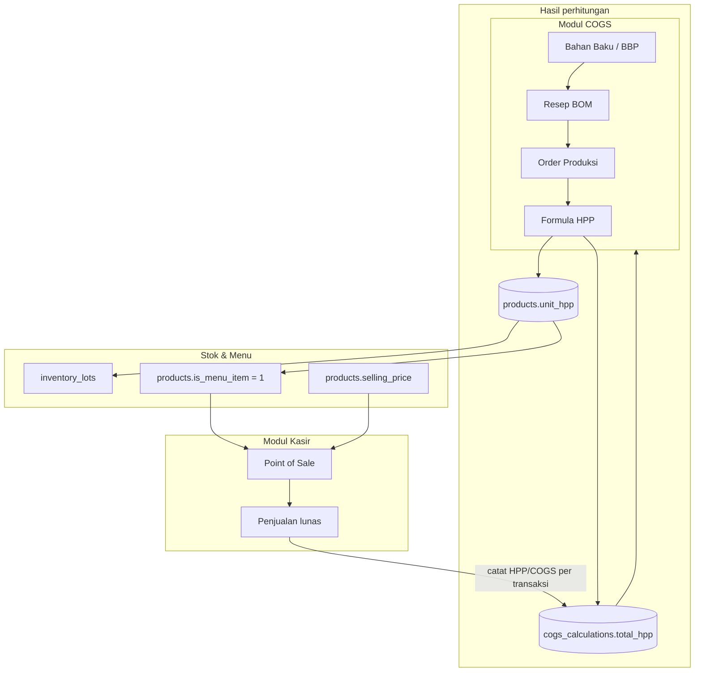

# Alur HPP = COGS & Integrasi Menu Kasir

## Prinsip utama

**HPP (Harga Pokok Penjualan)** adalah satu-satunya hasil perhitungan biaya.

**COGS (Cost of Goods Sold)** bukan rumus terpisah — nilainya **di-link** dari HPP:

```
COGS = HPP
unit_cogs = unit_hpp
total_cogs = total_hpp
```

Di database, kolom `total_cogs` / `unit_cogs` disalin otomatis dari `total_hpp` / `unit_hpp` saat perhitungan disimpan.

---

## Diagram alur lengkap



---

## Rumus HPP (satu formula)

### Saat produksi selesai

```
HPP = Bahan Langsung + Tenaga Kerja + Overhead
unit_hpp = HPP ÷ jumlah produksi
```

Hasil disimpan ke:
- `cogs_calculations` (riwayat)
- `products.unit_hpp` (HPP terbaru per produk)
- `inventory_lots.unit_cost` (stok masuk pakai HPP/unit)

### Saat penjualan di kasir

```
HPP transaksi = biaya stok yang dikonsumsi + overhead penjualan
unit_hpp = HPP transaksi ÷ qty terjual
COGS = HPP  (nilai sama, kolom terpisah untuk laporan keuangan)
```

---

## Langkah operasional

| # | Modul | Langkah | Output |
|---|--------|---------|--------|
| 1 | COGS | Input bahan baku & terima stok | `inventory_lots` |
| 2 | COGS | Buat produk jadi + resep BOM | `products`, `bill_of_materials` |
| 3 | COGS | Produksi → selesai | `unit_hpp` terisi |
| 4 | COGS | Centang **Tampilkan sebagai menu di Kasir** + atur **harga jual** | `is_menu_item`, `selling_price` |
| 5 | Kasir | Atur **stok menu**, gambar, kategori | stok POS |
| 6 | Kasir | Jual di POS | `pos_orders`, `sales_transactions` |
| 7 | Sistem | Otomatis catat HPP/COGS | `cogs_calculations` |

---

## Tabel database penting

| Tabel | Kolom kunci | Fungsi |
|-------|-------------|--------|
| `products` | `unit_hpp` | HPP per unit (dari produksi) |
| `products` | `selling_price` | Harga menu di kasir |
| `products` | `is_menu_item` | Produk stok → tampil di kasir |
| `cogs_calculations` | `total_hpp`, `unit_hpp` | Sumber perhitungan |
| `cogs_calculations` | `total_cogs`, `unit_cogs` | Link ke HPP (laporan keuangan) |
| `pos_order_items` | `unit_price` | Harga jual saat transaksi |
| `sales_transactions` | `selling_price`, `total_revenue` | Pendapatan |

---

## Margin menu kasir

```
Margin kotor = selling_price − unit_hpp
Margin % = (Margin kotor ÷ selling_price) × 100
```

Tampil di **Kasir → Kelola Menu** setelah HPP terhitung dari produksi.

---

## Migrasi database

Jalankan salah satu:

```bash
php artisan migrate --force
```

atau SQL manual:

```
database/unify_hpp_cogs.sql
```

File SQL akan:
1. Menambah kolom `unit_hpp`, `is_menu_item` di `products`
2. Menambah kolom `total_hpp`, `unit_hpp` di `cogs_calculations`
3. Menyalin data lama (`total_cogs` → `total_hpp`)
4. Menandai produk jadi/setengah jadi sebagai menu kasir

### Rollback manual

Lihat bagian komentar di bagian bawah `database/unify_hpp_cogs.sql`.
